# Comparisons across data sets

In this README document we compare results between data sets, for example, how data sets
change with the density of hydrogen atoms, or how the data sets change with the number
of hydrogen atoms (and therefore the number of electrons). Comparisons between
closed shell and unrestricted open shell formulations are made in each of sub-directories.

# Comparing different densities

## H2 cases

The H2 cases involve 2-electron systems for which the equations can be solved largely
analytically. In particular there is only alpha-beta correlation as there are no
alpha-alpha nor beta-beta pairs.

For the restricted calculations we see for the diagonal elements

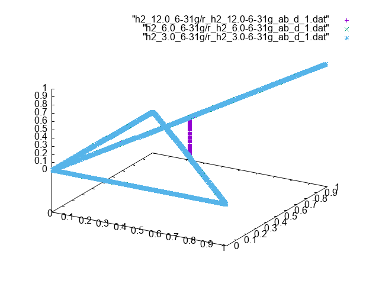

and for the off-diagonal elements

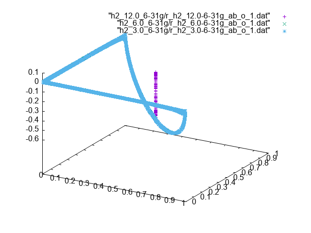

For the unrestricted calculations we see for the diagonal elements

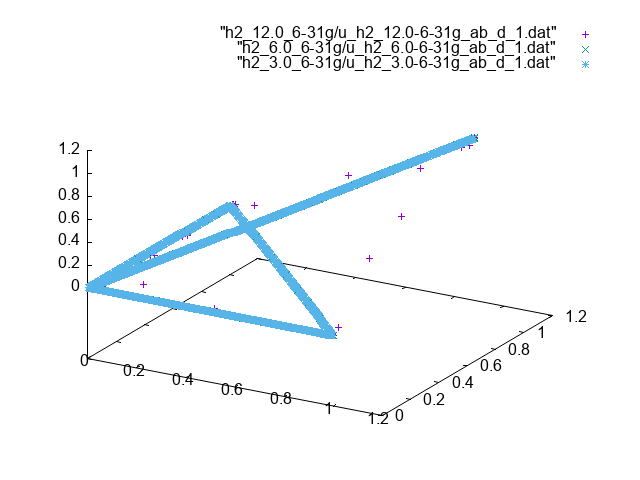

and for the off-diagonal elements

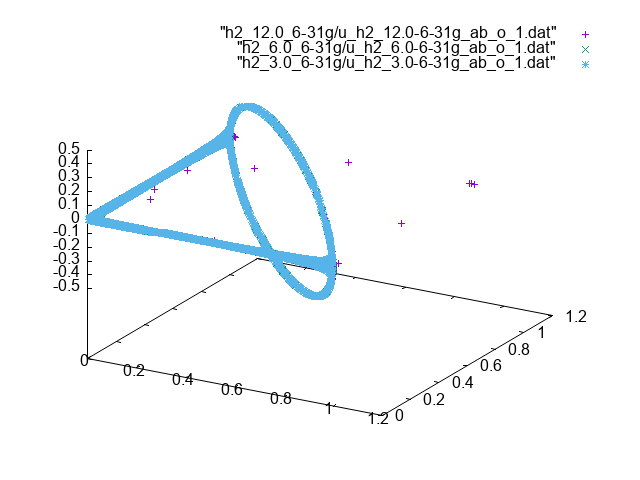

From this we see a few things:
- In general for the 2-electron systems the density does not seem to affect
  the results much, even though the the total energies should
- Only in the lowest density case there are some deviations:
  - in the restricted case there are "stems" in the diagonal and off-diagonal elements
    at the lowest density which disappear at higher densities
  - in the unrestricted case there a few points with the lowest density
    that disappear at higher densities
- the artifacts above seem to relate to uncorrelated electrons as they only
  occur at low atom/electron densities

## H4 cases

For H4 there are 4 electrons, the coordinates of two of these have to be integrated
out to generate the 2RDM elements. As a consequence the 2RDM elements will be
generated by multiple terms. The way these terms mix is likely to be density dependent.

For the 2RDM elements we have in order of increasing density, from the lowest
density

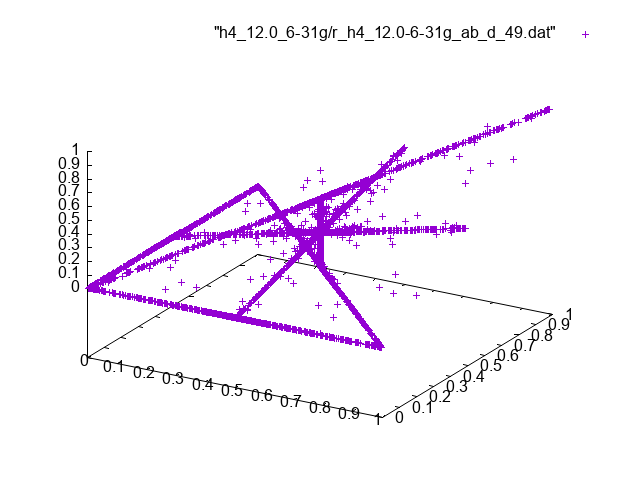

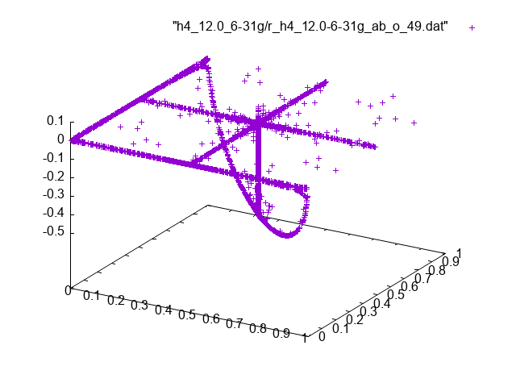

to the medium density

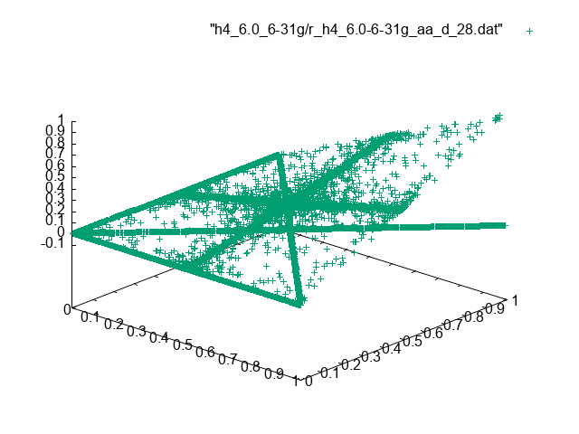

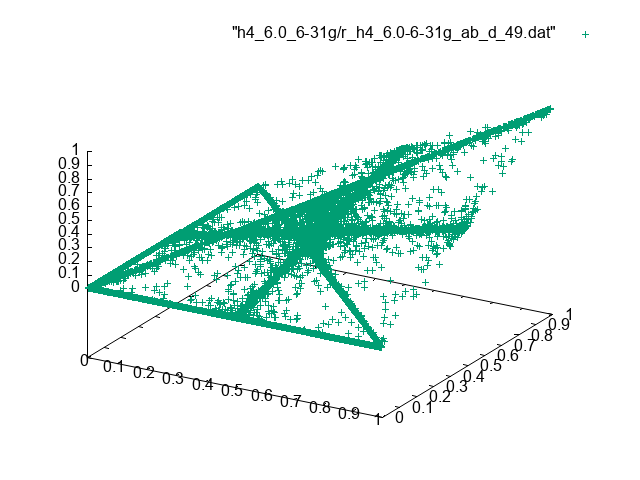

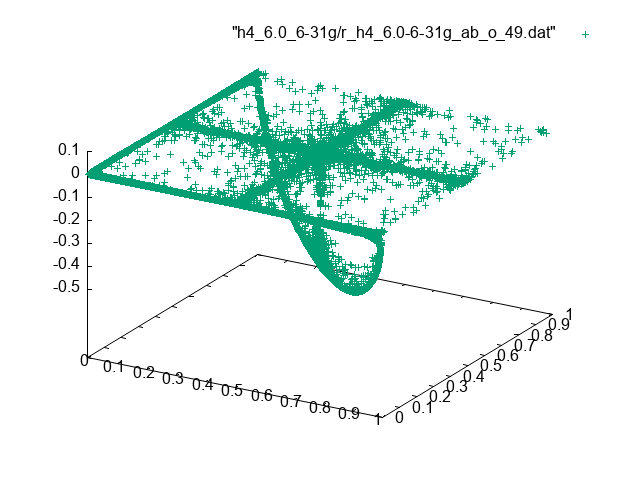

to the highest density

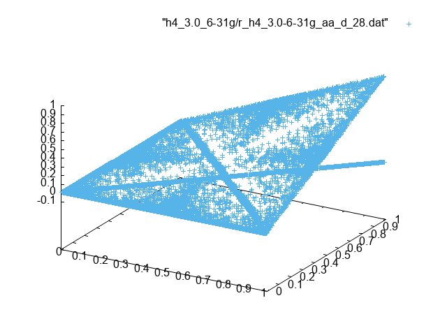

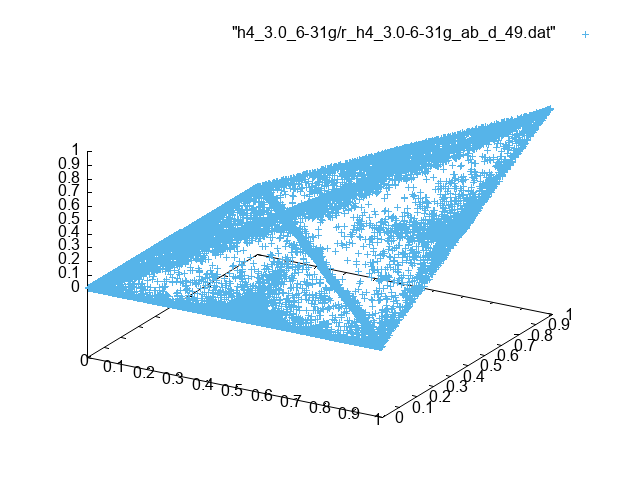

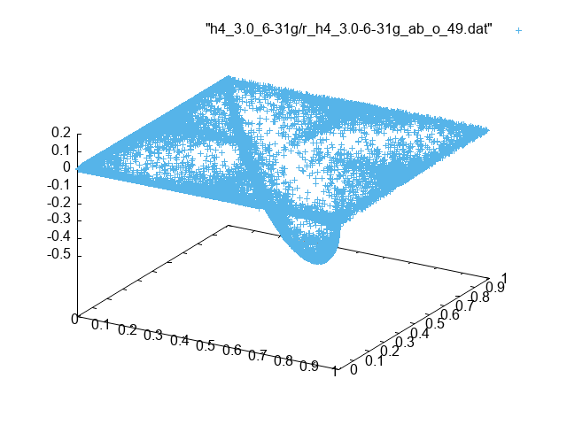

As is shown above, for the lowest densities the data points essentially fall
onto clear lines. As the density increases these lines become increasingly
fuzzy.

## H6 cases

With H6 we have six electrons, four of those have to be integrated to obtain
the 2RDM elements. In order of increasing densities we get, for the lowest
densities

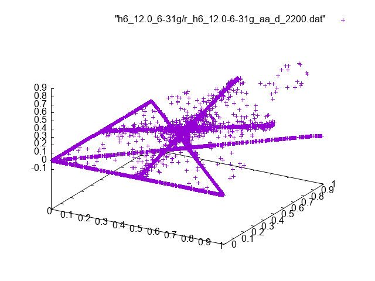

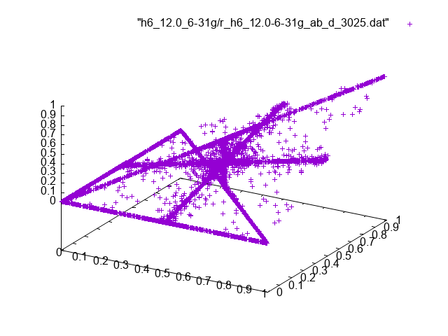

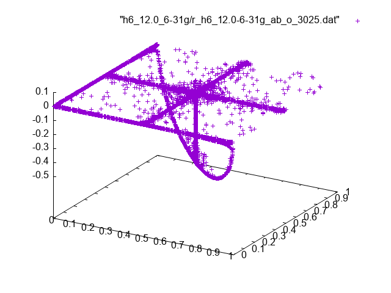

to the medium densities

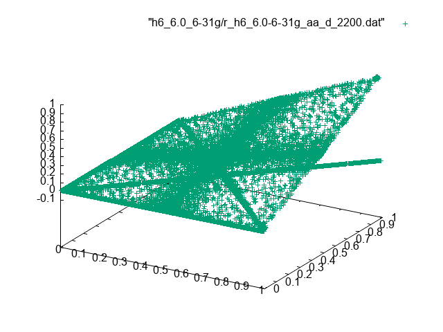

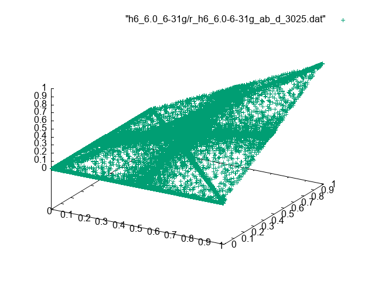

to the highest densities

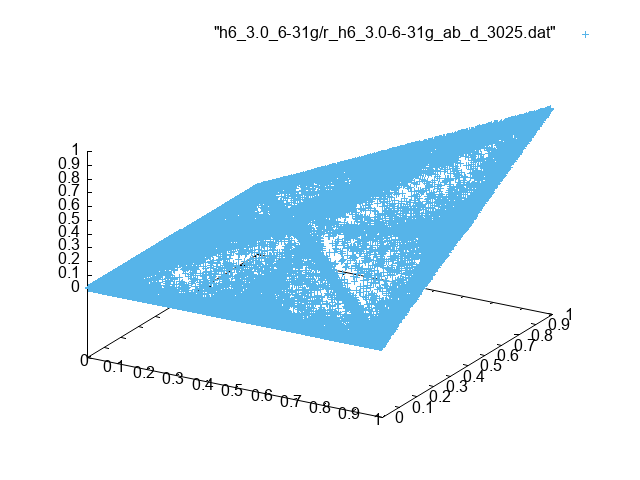

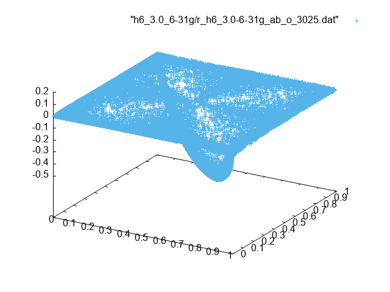

## H8 cases

