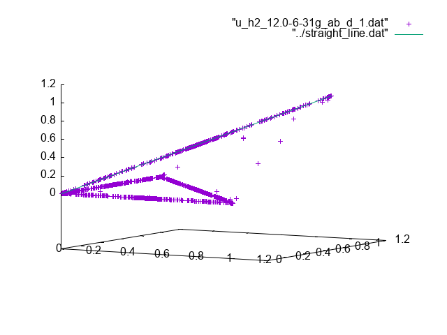
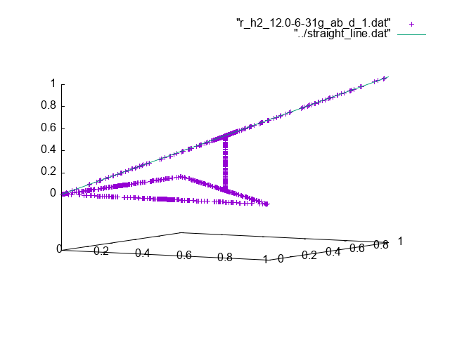
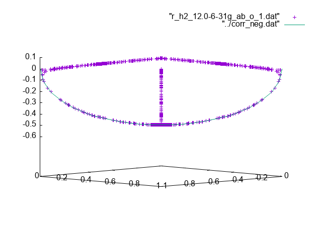

# H2 12.0 basis 6-31g

In this case the basis set is slightly larger than the minimal basis set.
H2 is just a 2-electron system so for the 2-electron density matrix
we don't integrate any particles out. As a result every contribution is
just a single term.

For 2-electron systems we find that there is a difference between
unrestricted full-CI results and restricted full-CI results, but
the difference is not very big. For unrestricted full-CI calculations
and restricted full-CI calculations respectively we get for the diagonal
elements

For the unrestricted alpha-beta electron correlation we have for the diagonal elements:
- the only non-zero elements are ones where $d^a == d^b$
- those elements are equal to $\sqrt{d^a d^b}$
- the sum of alpha electron occupation numbers is 1 as there is only 1
  alpha electron.
- the sum of beta electron occupation numbers is 1 as there is only 1
  beta electron.
- the sum of non-zero elements must be 1 as there is only 1 alpha-beta
  electron pair, this is confirmed by the fact that $d^a == d^b$ therefore
  we can rewrite $\sqrt{d^a d^b} = \sqrt{d^a d^a} = abs(d^a)$ and occupation
  numbers are always positive. So the sum over $\sqrt{d^a d^b}$ equals
  the sum over $d^a$ as well as the sum over $d^b$, either of which are 1.
For the restricted diagonal elements we see very similar results except
that for $d^a = d^b = 1/2$ there are a number of points below the
Lowdin-Shull line.

For the unrestricted and restricted off-diagonal elements respectively
we get

For the off-diagonal elements we have:
- the only non-zero elements are the ones where $d^a == 1-d^b$
- those elements are equal to $\sqrt[4]{d^a (1-d^a) d^b (1-d^b)}$
- for the unrestricted case we have both positive and negative
  off-diagonal elements, whereas for the restricted case we have
  only negative elements.
- in addition for the restricted elements we have at $d^a = d^b = 1/2$
  a number of points above the line.
