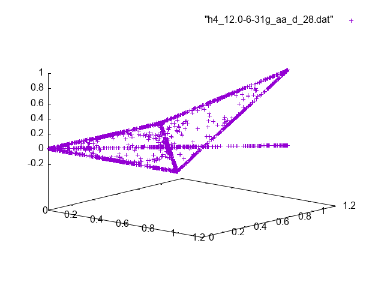
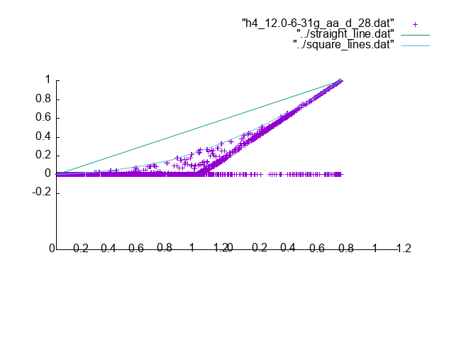
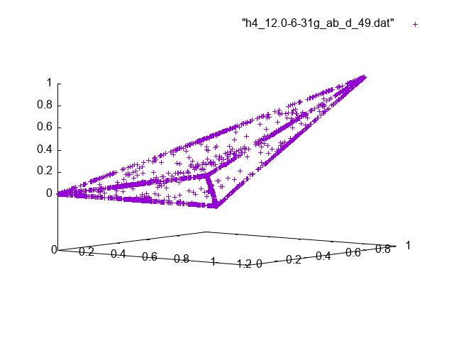
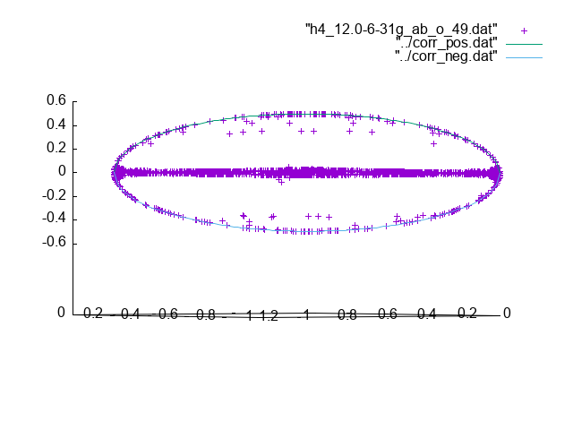

# H4 12.0 basis 6-31g

In this case there 4 electrons, 2 of each spin. For the 2-electron density
matrix we have to integrate 2 electrons out. As a result we have alpha-alpha,
alpha-beta, and beta-beta 2-electron density matrix elements. Each of these
elements are generated from multiple Slater determinant pairs (and
corresponding CI coefficient pairs).

For the alpha-alpha pairs we have

The non-zero elements concentrate on 2 lines:
- For one line $d^a==1$ and $0 \le d^b \le 1$
- For the other line $d^b==1$ and $0 \le d^a \le 1$
- There is also a line where $d^a_i = d^a_j$ and the diagonal element
  is $d^a_i d^a_j$. In this case that line almost not populated.
There are also some points between the demarcation lines. These points
stem from partial cancelation of terms in the 2-electron density matrix
elements that don't occur in the 1-electron occupation numbers.
The elements are limited from above by the third line is visible in the
side view

For the alpha-beta pairs we have

Now we see that the non-zero elements are concentrated on 3 lines.
- The diagonal line, which is also present in the 2-electron case
- The first two additional lines that appeared in the alpha-alpha pairs
Again some elements lie between these lines due to partial cancelation
in the 2-electron density matrix elements.

In addition for the alpha-beta off-diagonal elements we have

where we see the same oval shape as for H2.

