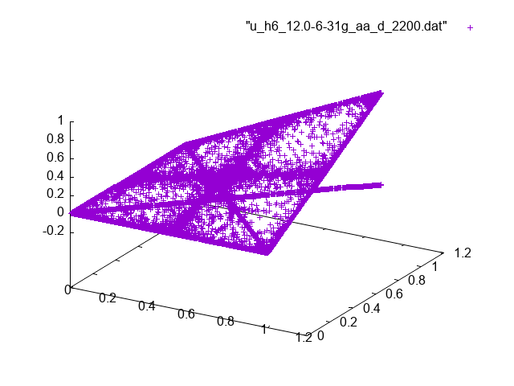
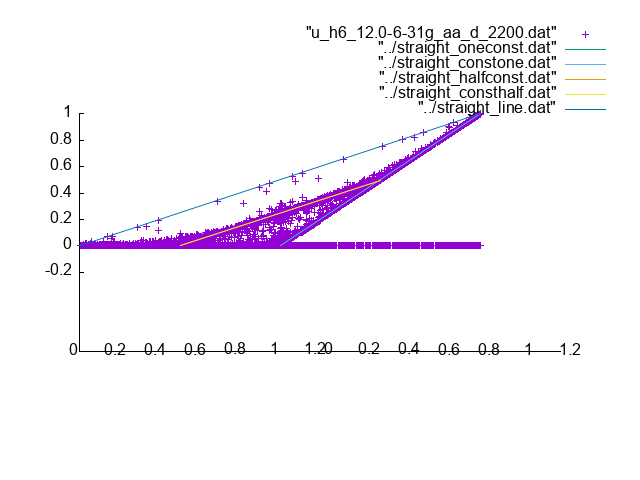
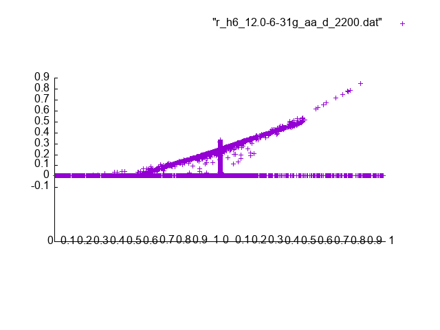
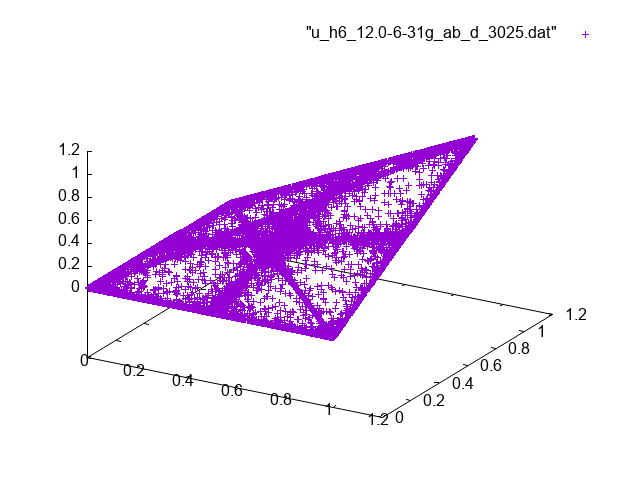
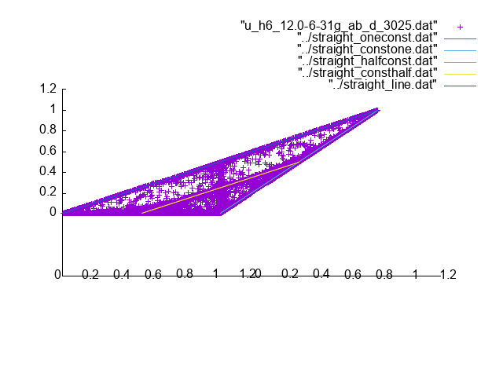
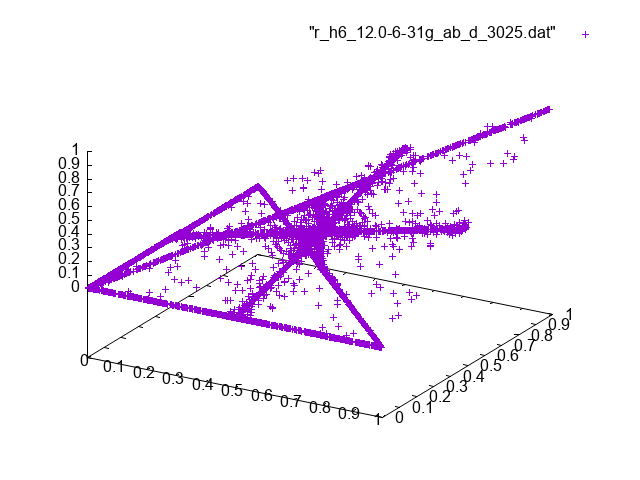
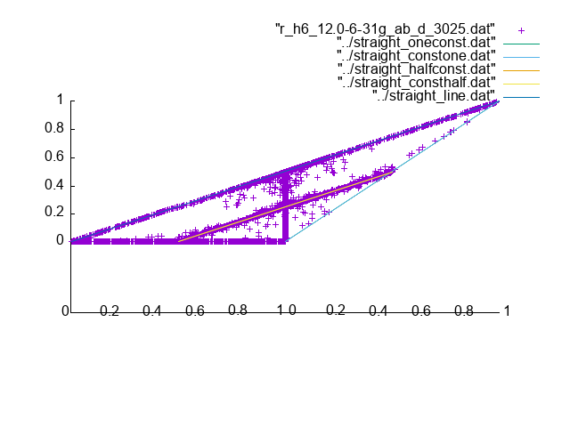
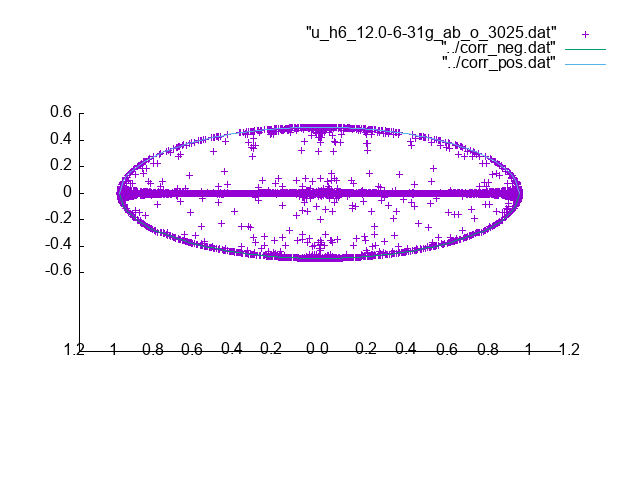
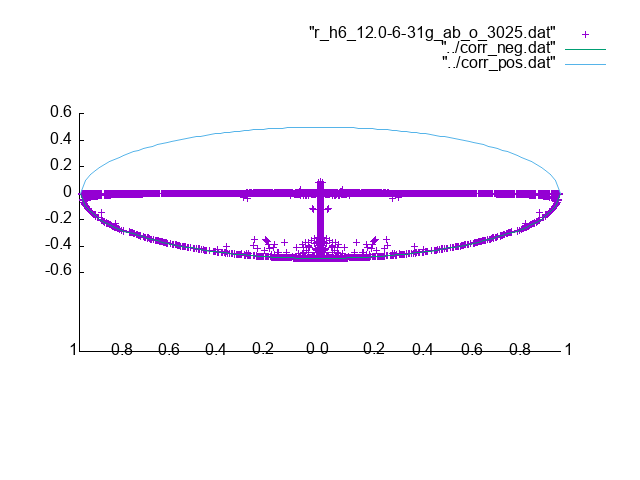

# H6 12.0 basis 6-31g

For the unresricted alpha-alpha pairs we have

The values of the elements are limited by the same lines
as for the H4 case.

Likewise for the restricted alpha-alpha pairs we have

For the unrestricted alpha-beta pairs we have

For the restricted alpha-beta pairs we have

For the unrestricted off-diagonal elements we have

and for the restricted off-diagonal elements we have

which ones again shows the oval shape.
