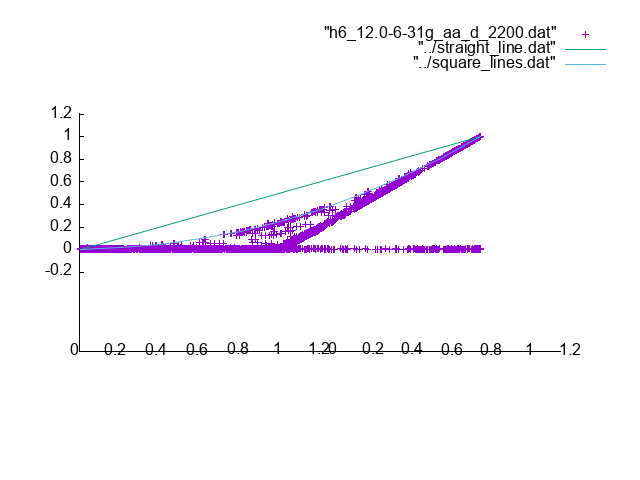
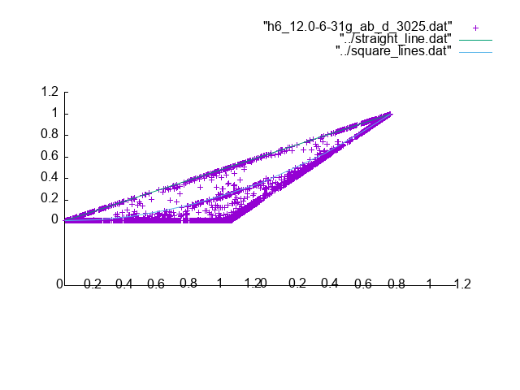
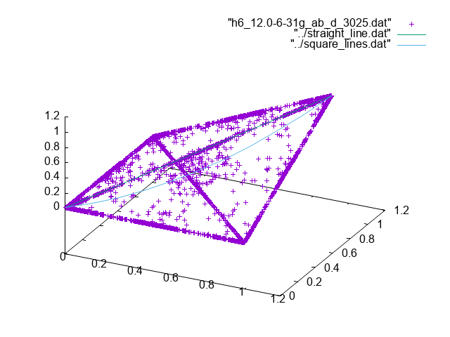
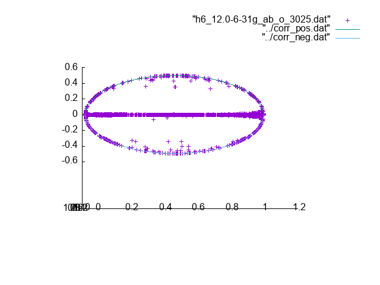

# H6 12.0 basis 6-31g

For the alpha-alpha pairs we have

The values of the elements are limited by the same lines
as for the H4 case.

For the alpha-beta pairs we have

Here it looks like there is something "new" happening.
There are points that concentrate on the straight diagonal line.
From this side view it also appears like there are a lot of point
concentrating on the $d^a d^b$ line. From a different angle
this is not true as most points are displaced to before or behind
this line as is shown here

Nevertheless, it is interesting that this line seems
to become more prominent here.

For the off-diagonal elements we have

which ones again shows the oval shape.
