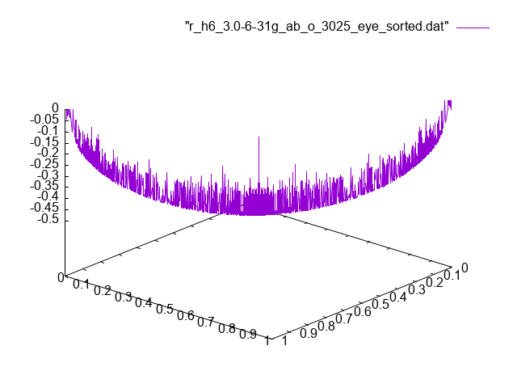

# H6 case

In the parent directory we have seen that the lines become fuzzy
when the atom density increases. Here I am looking at the "eye line".
For low densities this is a clear line. Here I extract just the points
along this line, sort them, and then have gnuplot draw a line through
this sequence of points.

This line shows large variations in the 2RDM elements for small variations
in the 1-electron occupation numbers. There seems little hope of defining
a function that models the 2RDM elements as a function of the occupation
numbers.
