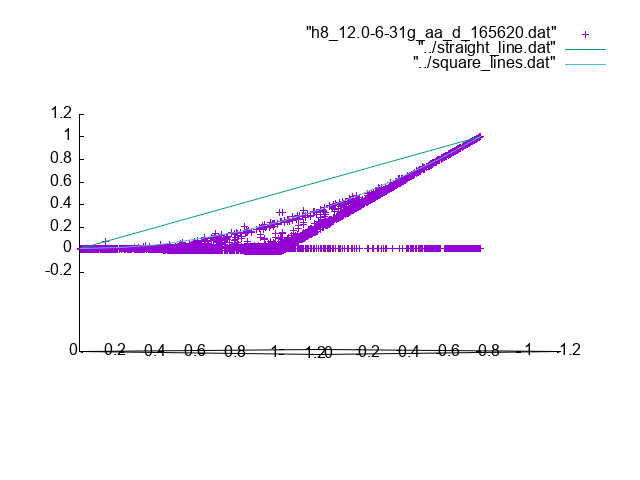
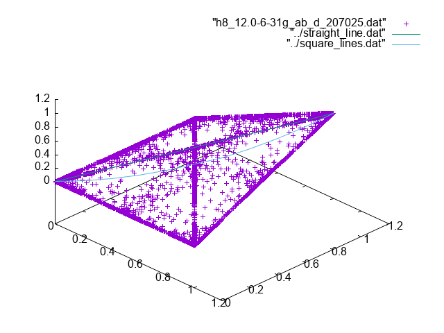
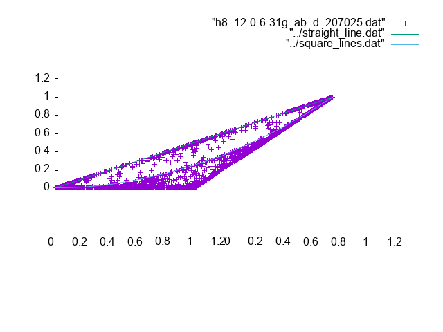
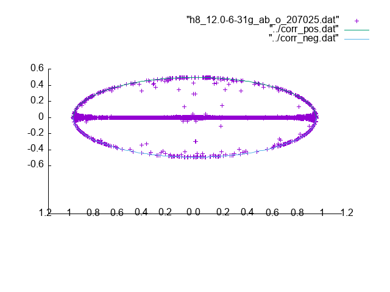

# H8 12.0 basis 6-31g

For the alpha-alpha pairs we have

The elements are limited in the same way as for H4 and H6.

For the alpha-beta pairs we have for the diagonal elements

Again in the overview we see that the points are spread out.
In the side view we see two lines emerge similarly to the
H6 case.

The off-diagonal elements present the usual oval shape

